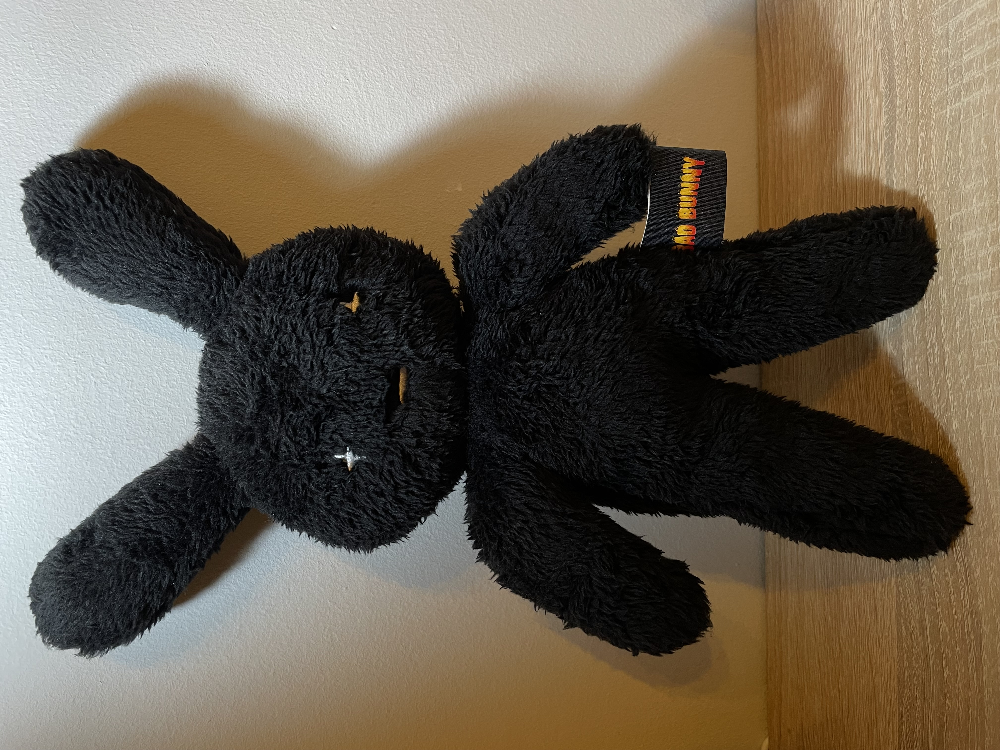

# REPOSITORIO GITHUB ANTONIO GUERRERO 🐰

(Peluche de colección Bad Bunny)

## DESCRIPCION
Subida del retogit de Entornos de desarrollo

## COMPONENTES
-PDF con los pasos a seguir e imagenes.

-Read me propio actualizado con imagen.

-Etiquetas MarkDown incluidas.
